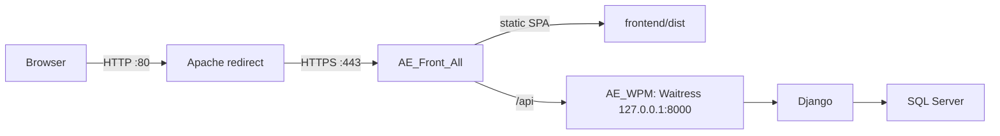

# AE WPM Apache Production Deployment Guide

This is the production deployment reference for AE WPM on Windows. It records
the configuration verified on 2026-08-26. Keep server-local certificates,
service environment variables, and logs outside Git.

## 1. Production topology

| Layer | Current implementation | Address / location |
|---|---|---|
| Public entry | Windows service `AE_Front_All` (Apache 2.4) | TCP 80 redirects to HTTPS; TCP 443 serves the application |
| Frontend | Vue/Vite production output | `E:\AE_WPM_Demo\frontend\dist` |
| API reverse proxy | Apache `mod_proxy_http` | `/api` -> `http://127.0.0.1:8000/api` |
| Backend | Windows service `AE_WPM` (NSSM -> Waitress -> Django) | Bound only to `127.0.0.1:8000` |
| Backend working directory | Django project directory | `E:\AE_WPM_Demo\backend` |
| Python virtual environment | Dedicated production venv | `E:\wpm_env` |
| Database | SQL Server via `mssql-django` and ODBC | `SCRBAEXDEFRM218`, database `WPM Project` |

Current server names include `wpmworkflow.crb.apmoller.net`,
`SCRBAEXDEFRM217.crb.apmoller.net`, and `10.176.115.28`. Use the production
DNS name in user-facing links; do not make port 8000 reachable from the
network.



## 2. Apache configuration

Apache lives in `C:\Apache24` and is installed as the native Windows service
`AE_Front_All`:

```powershell
Get-Service AE_Front_All, AE_WPM
Get-CimInstance Win32_Service -Filter "Name='AE_Front_All'" |
  Select-Object Name, State, StartMode, PathName
```

The active site files are:

| File | Purpose |
|---|---|
| `C:\Apache24\conf\extra\sites\05-http-redirect.conf` | `*:80` virtual host that permanently redirects to the same HTTPS host/path |
| `C:\Apache24\conf\extra\sites\10-wpm-ssl.conf` | `*:443` WPM virtual host |
| `C:\Apache24\conf\httpd.conf` | Enables required modules and includes the site files |

The HTTPS virtual host must retain these responsibilities:

1. `DocumentRoot "E:/AE_WPM_Demo/frontend/dist"` and a matching allowed
	`<Directory>` block.
2. SPA fallback that rewrites non-files and non-directories to `/index.html`.
	`/api` must remain proxied, not rewritten to the SPA.
3. `ProxyPass` and `ProxyPassReverse` from `/api` to
	`http://127.0.0.1:8000/api`.
4. `ProxyPreserveHost On`, `X-Forwarded-Proto https`, and
	`X-Forwarded-Port 443` so Django receives the original request context.
5. `Timeout 300` and `ProxyTimeout 300`; the chatbot can exceed Apache's
	default 60-second proxy timeout.
6. TLS certificate/key paths under `C:\Apache24\conf\ssl`. Keep private keys
	readable only by the Apache service identity and administrators.
7. The `/assets/node_modules/@maersk-global/icons` alias currently serves MDS
	icons from `frontend\node_modules`. `vite.config.js` also copies icons into
	the build output, so verify the alias after dependency/build changes and
	remove it only after confirming all icons are served from `dist`.

Do not edit the production site config and restart blindly. Validate first:

```powershell
C:\Apache24\bin\httpd.exe -t
C:\Apache24\bin\httpd.exe -S
Restart-Service AE_Front_All
```

Apache logs are in `C:\Apache24\logs`; the relevant production logs are
`wpm-ssl-access.log`, `wpm-ssl-error.log`, `wpm-http-redirect-access.log`, and
`wpm-http-redirect-error.log`.

## 3. Backend service and environment

`AE_WPM` is an automatic NSSM service. Its process should be equivalent to:

```powershell
E:\wpm_env\Scripts\python.exe -m waitress `
  --listen=127.0.0.1:8000 config.wsgi:application
```

Its working directory must be `E:\AE_WPM_Demo\backend`; this makes
`config.wsgi:application` import correctly. The service wrapper and its logs
are under `E:\Apps\services\wpm`. Inspect service state and its listener:

```powershell
Get-Service AE_WPM
Get-NetTCPConnection -LocalAddress 127.0.0.1 -LocalPort 8000 -State Listen |
  ForEach-Object {
	 Get-CimInstance Win32_Process -Filter "ProcessId=$($_.OwningProcess)"
  } | Select-Object ProcessId, CommandLine
```

The Django process loads `E:\AE_WPM_Demo\.env` during settings
initialization. This single Git-ignored file contains the active SendGrid API
key and the chatbot's LLM configuration; use `.env.example` as its non-secret
template. A Windows service environment variable takes precedence over the
value in `.env`, so either manage the secret there or keep the service variable
unset and manage the Git-ignored `.env` file. Do not store the active key in
source control.

Production environment values are:

| Variable | Production requirement |
|---|---|
| `DJANGO_DEBUG` | `False` |
| `DJANGO_SECRET_KEY` | Unique high-entropy secret |
| `DJANGO_ALLOWED_HOSTS` | Exact production DNS names/IPs; do not use `*` |
| `DJANGO_CORS_ORIGINS` | Exact HTTPS application origin(s) only |
| `DJANGO_DB_ENGINE` | `mssql` |
| `DJANGO_DB_NAME`, `DJANGO_DB_HOST`, `DJANGO_DB_DRIVER` | Production SQL Server connection values |
| `DJANGO_SENDGRID_API_KEY` | SendGrid secret stored in `.env`, service environment, or an approved secret store |
| `DJANGO_CA_BUNDLE` | Absolute path to the corporate TLS-inspection CA bundle used for SendGrid HTTPS |
| `DJANGO_DEFAULT_FROM_EMAIL`, `DJANGO_MIGRATION_INTAKE_NOTIFY_TO` | Approved sender and recipients |
| `DJANGO_HTTPS_PROXY` | Corporate proxy only when required for outbound SendGrid HTTPS |

When changing NSSM environment variables, set the **complete**
`AppEnvironmentExtra` value in one operation: `nssm set ... AppEnvironmentExtra`
replaces the existing block. Restart `AE_WPM` after a change; use `-Force` if
Windows reports dependent services.

The service currently runs as `LocalSystem` and SQL Server uses Windows Trusted
Connection. Ensure the SQL Server grants the server machine account the required
database permissions before running migrations. Do not use the repository's
`backend/db.sqlite3` as a production database.

## 4. Standard release procedure

Run from an elevated PowerShell session on the production server. Schedule a
maintenance window for schema changes or changes that are not backward
compatible.

1. Record the current Git revision, back up the SQL database according to the
	DBA procedure, and keep the prior frontend build available for rollback.
2. Fetch the approved revision and inspect the change set:

	```powershell
	Set-Location E:\AE_WPM_Demo
	git fetch --all --prune
	git status
	git log -1 --oneline
	```

3. Update the approved branch/revision using the team's Git workflow. Do not
	overwrite server-only settings, certificates, service files, or production
	secrets.
4. Update Python dependencies in the existing production venv when
	`requirements.txt` changed:

	```powershell
	E:\wpm_env\Scripts\python.exe -m pip install -r E:\AE_WPM_Demo\requirements.txt waitress
	```

5. Apply Django migrations against MSSQL. Run them in the production service
	identity or an approved account that has the same SQL Server permissions:

	```powershell
	Set-Location E:\AE_WPM_Demo\backend
	E:\wpm_env\Scripts\python.exe manage.py migrate --database=default
	```

6. Install frontend dependencies only when lock/package files changed, then
	build the SPA:

	```powershell
	Set-Location E:\AE_WPM_Demo\frontend
	npm ci
	npm run build
	```

	If Windows locks files in `dist`, stop Apache only for the build, then start
	it again even when the build fails:

	```powershell
	Stop-Service AE_Front_All
	npm run build
	Start-Service AE_Front_All
	```

7. Restart the backend so Waitress loads the new Django code, validate Apache
	configuration if it changed, then restart Apache only when needed:

	```powershell
	Restart-Service AE_WPM -Force
	C:\Apache24\bin\httpd.exe -t
	Restart-Service AE_Front_All
	```

8. Execute the verification checklist below before declaring the release
	complete.

## 5. Release verification and rollback

Run these tests locally on the server, then repeat the HTTPS checks from a
separate client on the production network:

```powershell
Get-Service AE_Front_All, AE_WPM
curl.exe -fsS http://127.0.0.1:8000/api/health/
curl.exe -fsSI http://127.0.0.1/
Resolve-DnsName wpmworkflow.crb.apmoller.net
curl.exe --noproxy '*' -fsS https://wpmworkflow.crb.apmoller.net/api/health/
curl.exe --noproxy '*' -fsSI https://wpmworkflow.crb.apmoller.net/
```

If the server is not configured to resolve the production DNS name yet, verify
the deployed listener with the certificate-covered IP as a temporary fallback:

```powershell
curl.exe --noproxy '*' -fsS https://10.176.115.28/api/health/
curl.exe --noproxy '*' -fsSI https://10.176.115.28/
```

Expected results:

- Both services are `Running` and `Automatic`.
- Backend health JSON contains `"status":"ok"` (it may include an additional
	human-readable `message`).
- HTTP returns a 301 redirect to HTTPS.
- HTTPS returns the SPA and `/api/health/` returns the same health JSON.
- Test a client-side route by refreshing it directly; it must render the SPA,
  not an Apache 404.
- Inspect the latest lines of Apache's `wpm-ssl-error.log` and the NSSM
  `ae-wpm-stderr.log` for errors.

For a frontend-only fault, restore the saved previous `frontend\dist` build and
restart Apache. For a backend code fault, return to the prior approved revision,
reinstall its dependencies if needed, then restart `AE_WPM`. Treat database
migration rollback as a separate, DBA-approved operation; do not improvise
schema rollback during an incident.

## 6. Production readiness checklist

- [ ] `DJANGO_DEBUG=False`, a unique `DJANGO_SECRET_KEY`, exact hosts, and exact
  CORS origins are configured outside source control.
- [ ] SendGrid credentials are not in source files or command history. Rotate
  any key that was ever committed or disclosed.
- [ ] TLS certificate covers the published DNS name, has a renewal owner, and
  Apache can read the renewed files before the old certificate expires.
- [ ] Only 80/443 are exposed in Windows Firewall; port 8000 remains loopback
  only.
- [ ] SQL Server backup/restore and service-account database permissions are
  verified.
- [ ] `httpd.exe -t`, local health, HTTPS health, and a browser smoke test pass.
- [ ] Current revision, deployer, migration result, and validation result are
  recorded in the release ticket.

## 7. Development port safety

On the deployment machine, `8000` is reserved exclusively for `AE_WPM` and
MSSQL. `backend/manage.py runserver` defaults to `127.0.0.1:8001` for local
development with SQLite. Never start a development server on 8000. To point
Vite at the production backend for an approved troubleshooting session, use:

```powershell
Set-Location E:\AE_WPM_Demo\frontend
$env:VITE_API_TARGET = 'http://127.0.0.1:8000'
npm run dev
```
